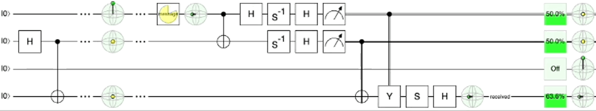

# 📡 Multi-Axis Quantum Teleportation

This repository demonstrates a generalized **multi-axis quantum teleportation protocol** using different combinations of projective measurements beyond the standard $Z$-basis. Each notebook simulates and visualizes the teleportation process with a specific basis pair on the message $\ket{Msg}$ and ancilla qubits $\ket{A}$.

<p align="center">  </p>

---

## 📁 Folder Structure

```
.
├── assets/                      # Contains visual circuit diagrams
│
├── multi-axis QT/
│   ├── 0_ZZ_measurement.ipynb  # Z,Z basis teleportation circuit
│   ├── 1_YY_measurement.ipynb  # Y,Y basis teleportation circuit
│   ├── ...                     # Other measurement combinations
│   ├── basic_gates.py          # Gate and utility definitions
│
├── .gitignore
└── README.md
```

Each Jupyter notebook contains:
- Circuit diagram illustration
- Symbolic computation of the quantum state evolution using `sympy`
- Restoration operations applied by Bob based on measurement outcomes
- Final validation of teleportation correctness

---

### Requirements

- Python 3.8+
- [SymPy](https://www.sympy.org/)

Install the dependencies:
```bash
pip install sympy
```

---

<!-- ## 📎 References

- IBM Qiskit textbook: [Quantum Teleportation](https://qiskit.org/textbook/ch-algorithms/teleportation.html)
- Nielsen & Chuang, *Quantum Computation and Quantum Information* -->

<!-- --- -->


## 📬 Contact

Junyao Zhang [jz420@duke.edu](mailto:jz420@duke.edu)
